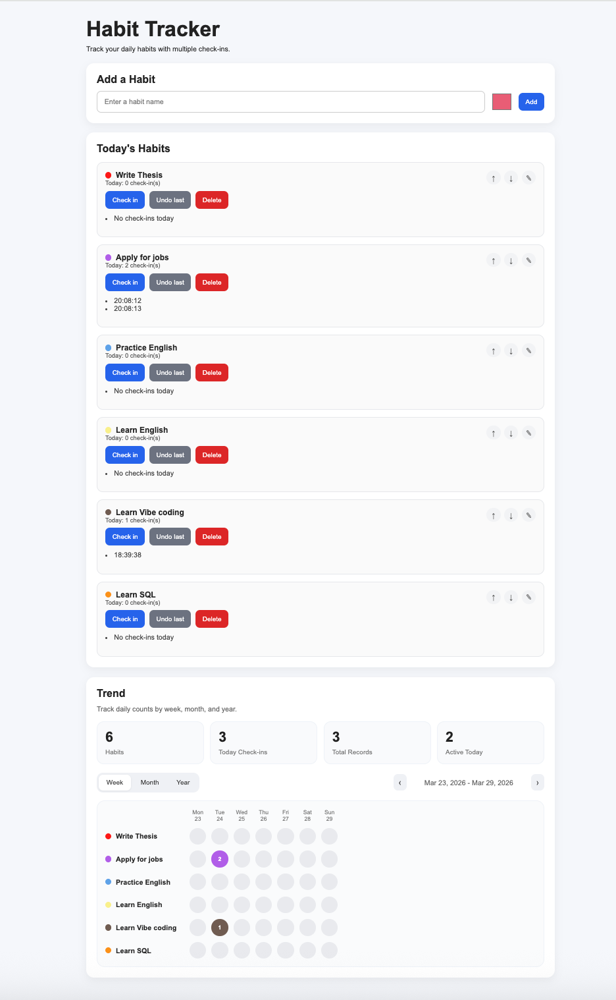

# Habit Tracker

🚀 **Live Demo:**  
https://yingyue-kou.github.io/habit-tracker/

📦 **Installable App (PWA)** – This app can be installed and used like a native application with offline support.

---

## 📸 Preview

---

## 📊 Overview

Habit Tracker is a lightweight, interactive web application designed to help users track daily habits with multiple check-ins and visualize progress over time.

The application is built as a **Progressive Web App (PWA)**, providing an app-like experience with installability and offline capabilities.

---

## ✨ Features

- Add custom habits with personalized colors  
- Multiple check-ins per day  
- Undo last check-in  
- Edit habit name and color  
- Reorder habits (move up/down)  
- Trend visualization (week / month / year)  
- Local data persistence (browser storage)  
- Installable as a desktop/mobile app  
- Offline support via caching  

---

## ⚡ Technical Highlights

- Built as a **Progressive Web App (PWA)** with installable functionality  
- Implemented **Service Worker caching** for offline access  
- Designed dynamic UI updates using **vanilla JavaScript (DOM manipulation)**  
- Developed client-side data persistence using **LocalStorage**  
- Created interactive trend visualization without external libraries  
- Structured project with separation of concerns (HTML / CSS / JavaScript)  

---

## 🛠️ Tech Stack

- HTML5  
- CSS3  
- JavaScript (Vanilla JS)  
- LocalStorage  
- Service Worker  
- Web App Manifest  

---

## 📁 Project Structure

index.html
style.css
script.js
manifest.json
sw.js
icon-192.png
icon-512.png

---

## 🚀 How to Use

1. Add a habit with a name and color  
2. Click to check in (supports multiple times per day)  
3. Edit or reorder habits as needed  
4. Switch between week / month / year views  
5. (Optional) Install the app from the browser for a native-like experience  

---

## 📌 Future Improvements

- Cloud synchronization (user accounts)  
- Data export (CSV / Excel)  
- Advanced analytics and insights  
- Mobile-native version (React Native / Mini Program)  
- Backend integration for cross-device usage  

---

## 👤 Author

**Yingyue Kou**  
Master’s student in Strategic Information Systems Management  
Stockholm University  

---

## 📄 Notes

This project was developed as a hands-on practice to strengthen front-end development skills and demonstrate the implementation of modern web application features such as PWA, local data persistence, and interactive data visualization.
